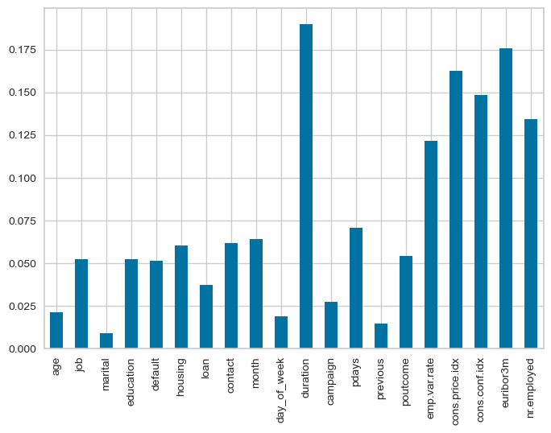
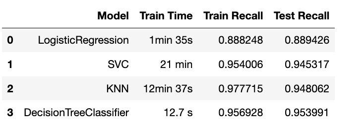
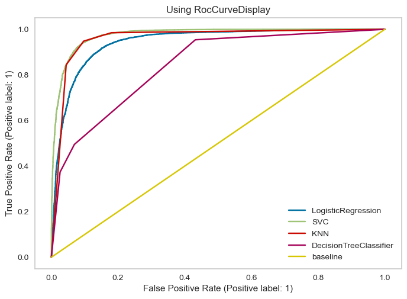
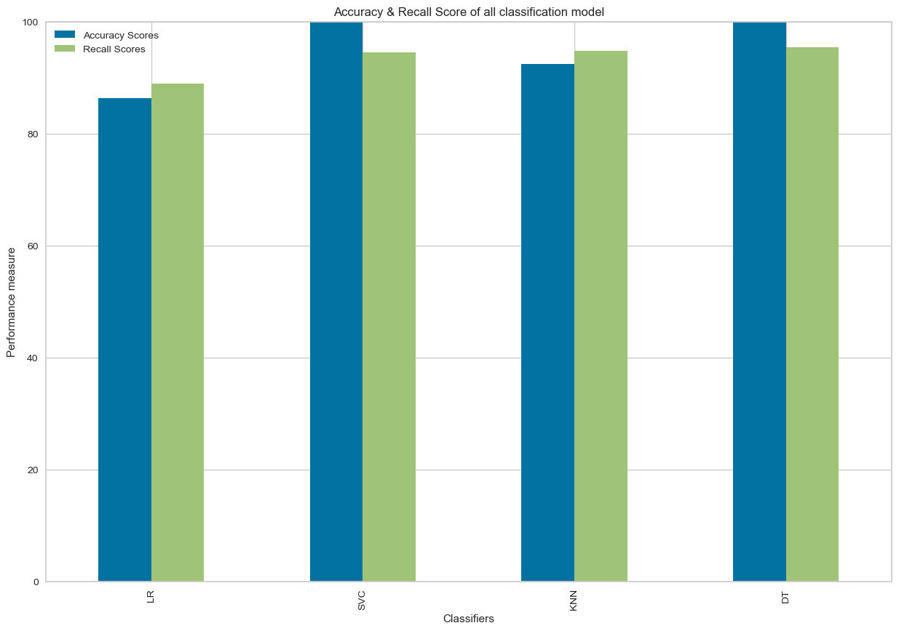

### Overview
The main objective of the application is to study & analyze the various classifiers like Logistic Regression, SVM, KNN, Decision Tree to choose the best model to analyze the dataset. The dataset used for this analysis is a Bank dataset which captures responses from a telemarketing campaign targetting customers with a high-yield term deposit. Please find below link to a jupyter notebook containing the necessary technical analysis of the dataset. 

https://github.com/vandavilli/BH-PCMLAI/blob/main/Application-5/prompt_III_va.ipynb

I have tried to use open source packages from YellowBrick to visualize classification reports, use of open source packages like missingno to view missing values in the dataset, pandas profiling packages to view the pandas dataset & produce HTML reports & many other useful open source libraries. The attempt is to demonstrate how these packages can be used for EDA, model development & analysis with a couple of lines of code.

### Data Analysis
The first stage of any modelling is data analysis. I used pandas profiler to generate EDA report ( full report embedded in the note book ). Eg. shown below

 

The advantage of using pandas profiler is with a few lines of code, a significant amount of analytical data gets generated for easy consumption & distribution. Less code implies more attention towards analysis & presentation of data to the stake holders.

### Understanding the Task
A well-trained ML model's objective is to predict accurately if the customer accepts an attractive long-term deposit application during a direct marketing campaign call. The main idea here is that a effective campaign reduces the marketing cost by X% and acquires Y% of the prospects. The dataset has various attributes ( personal & socio-economic indicators ) which when fed into a well trained model, can help drive better predictions to acquire prospects thereby driving costs down.

### Training, Testing & Baseline Model
Before presenting the data to machine learning modeling, it went through encoding, transformations & the class imbalance which would have signalled more "No" was eliminated using the standard techniques like dropping features & data that had little impact on the outcome, use LabelEncoders on categorical featurs & SMOTE to handle class imbalance. The next step was to use sklearn's train_test_split to create a training & test datasets.

### Model Comparisons
A baseline model is one in which we can always guess the most frequently occurring class. Without using any ML, i did a quick check for the score using the most frequently occuring class. This score came out to be 88.74%. 

The problem required me to use LogisticRegression as a baseline model & the test accuracy score was 86.3% ( close enough !!! )
 

#### Summary of all the classification results ( defaults with no hyperparameter tuning )
 

- The results indicate that the best performing classifier is a DecisionTreeClassifier, closely followed by SVM. The differentiator here is the time taken to train the model using SVM is very high.

### Improving the model

1 - Using sklearns feature selection, the top 3 features to include in the model:
 

- <i>duration</i> ... more the duration the better are the chances to engage the client & successfully sell the product
- <i>cons.price.idx</i> ... these are socio economic indicators and higher the cons.price index, the better the market conditions to sell a new product
- <i>euribor3m</i> ... socio economic indicator and also has a high degree of positive correlation

2 - Hyperparameter tuning and grid search. Although, after rebalancing the class, Accuracy "can" be used as a metric, I also wanted to study the recall measure. Below is the comparison across all the models along with the recall score ( although on balanced dataset )
 

- Here too, the results indicate that the best performing classifier is a DecisionTreeClassifier, closely followed by SVM. The differentiator here is the time taken to train the model using SVM is very high.

### Performance Metrics

### Conclusion:
Based on the Accuracy & Recall scores ( recall being a more relevant metric ), its clear that the Decision Tree Classifier is performing much better than all the classifiers, with the highest Accuracy score & the recall score. Although SVC performance is good, it loses out in terms of the fit time.

### Questions
- Duration is highly corelated with response because a duration of 0s essentually means that the customer has not purchased the product.
- Using socio - economic indicators in the dataset will help improve model performance and will make predictions more accurate. For e.g. emp.var.rate, cons.price.idx, cons.conf.idx
- Target campaigns based on marital status & age - for e.g. clients who are married & in-between the ages 30-35 are more responsive to term deposits
- Day of the week is not a good indicator for making a prediction & hence can be factored out in the dataset.
