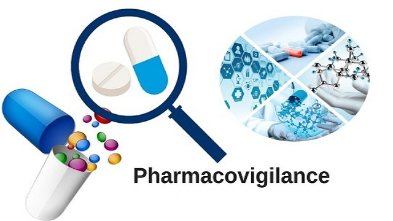

### Pharmacovigilance

**Vishu Andavilli**

#### Executive Summary
This project aims to enhance pharmacovigilance through Natural Language Processing (NLP) techniques for improved identification and understanding of adverse drug events (ADEs). By analyzing 5,000 annotated pharmacovigilance events from medical case reports, the project aims to enhance ADE categorization and knowledge, leveraging NLP for more efficient analysis and deeper insights.

#### Rationale
Pharmacovigilance plays a crucial role in monitoring medication safety, protecting patients from harm, ensuring regulatory compliance, and improving overall healthcare quality.

#### Research Question
This project focuses on improving the detection and understanding of adverse drug events (ADEs) to enable more effective risk management strategies, early interventions, and enhanced patient safety. Additionally, it aims to streamline pharmacovigilance processes and regulatory reporting, contributing to the development of safer medications. By leveraging advanced NLP techniques, the project seeks to enhance ADE detection, classification, and understanding, providing valuable data-driven insights for pharmacovigilance.

#### Data Sources
- [PHEE: A Dataset for Pharmacovigilance Event Extraction from Text](https://zenodo.org/record/7689970#.ZF1X3-zMLnQ)

#### Pharmacovigilance NLP Analysis

The project follows the CRISP-DM Methodology for Pharmacovigilance NLP Analysis:

1. **Business Understanding**: Initially, the project aimed to understand the business objectives by distinguishing between Adverse Events (AEs) and Potential Therapeutic Events (PTEs) to comprehensively analyze medication effects. Research questions, goals, and success criteria were defined.

2. **Data Understanding**: Relevant data sources, including medical case reports, electronic health records, and social media, were gathered and explored. Data quality, completeness, and availability for AE and PTE identification were assessed. Insights into the data structure, characteristics, and patterns were obtained through exploration techniques.

3. **Data Preparation**: NLP techniques were used to preprocess the data. Text cleaning, tokenization, and normalization were performed to standardize the textual data. Named entity recognition and classification models identified AE and PTE mentions. Semantic analysis extracted relevant features and attributes.

4. **Modeling**: NLP algorithms and techniques were employed to develop AE and PTE detection and classification models. Supervised learning approaches using annotated data trained and validated the models. Accurate identification and categorization of AEs and PTEs allowed for comprehensive medication effect analysis.

5. **Evaluation**: Performance and effectiveness of the developed models for AE and PTE identification were assessed using precision, recall, and F1-score metrics. Iterative evaluation refined the models and algorithms, enhancing their performance and reliability.

6. **Deployment**: (Outside the scope of the capstone project) Deployment of the evaluated models for practical use in pharmacovigilance processes is the next step.

7. **Monitoring**: (Outside the scope of the capstone project) Ongoing monitoring and evaluation of the deployed models ensure their effectiveness and alignment with changing data and business requirements. Potential issues are identified, and necessary adjustments are made.

By following the CRISP-DM Methodology, the project leveraged NLP techniques to distinguish between AEs and PTEs, providing valuable insights for pharmacovigilance analysis and improving medication safety.

#### Results
The project is ongoing, and additional results will be added as the model matures.

#### Next Steps
Future enhancements include:
1. Refining multi-event subset detection.
2. Integrating contextual information such as patient demographics and medical history.

These improvements will contribute to a more accurate and comprehensive analysis of ADEs and PTEs in pharmacovigilance.

#### Outline of the Project

1. [Exploratory Data Analysis (EDA)](https://github.com/vandavilli/BH-PCMLAI-VA/blob/main/Capstone/pharmacovigilance-main/eda.ipynb)
   - In-depth analysis of the PharmacoVigilance dataset.

2. [Sentiment Analysis Model](https://github.com/vandavilli/BH-PCMLAI-VA/blob/main/Capstone/pharmacovigilance-main/model.ipynb)
   - Sentiment analysis model to analyze sentiments in the dataset.

3. [Classification Reports & Scoring Metrics](https://github.com/vandavilli/BH-PCMLAI-VA/blob/main/Capstone/pharmacovigilance-main/scoring.ipynb)
   - Evaluate the model's performance using classification reports and scoring metrics.

#### Contact and Further Information

For any inquiries or further information, please feel free to contact:

- Vishu Andavilli
- Email: vishu.andavilli@gmail.com
- [LinkedIn](https://www.linkedin.com/in/vandavilli/)
